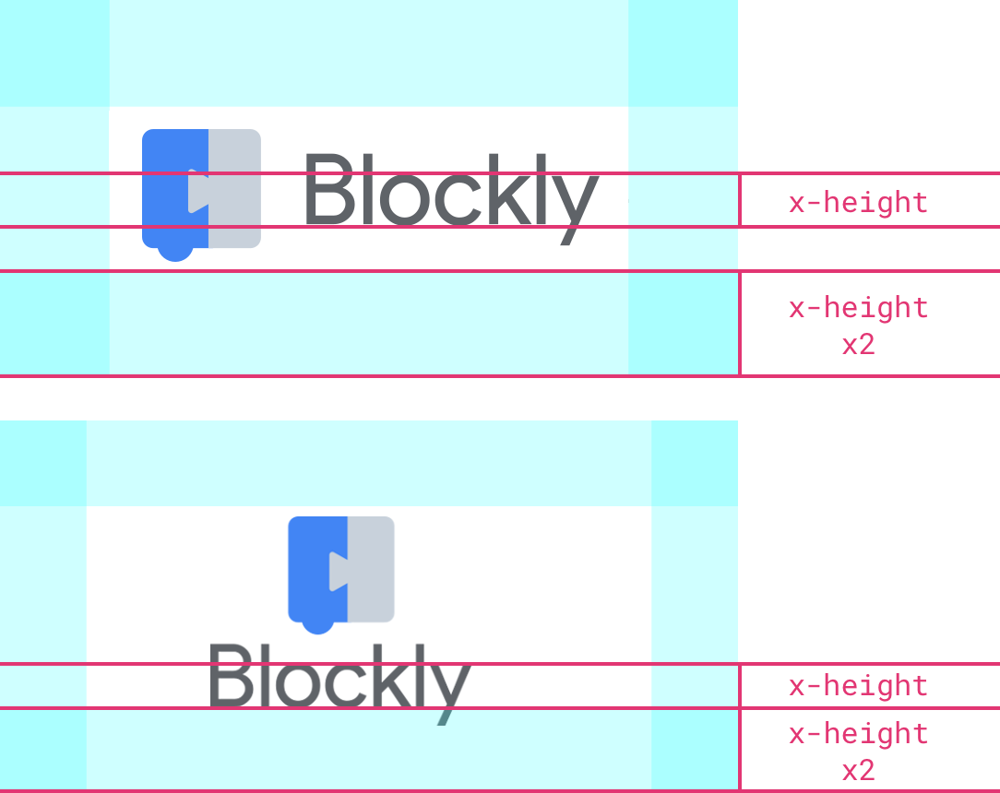

# Representing the Blockly brand

Blockly's code is open source and free to use without attribution.

However, we do encourage developers who are using Blockly to reference the product in their website, app, or product. This page describes the best practices for referring to Blockly and attributing it as well as appropriate uses of the logo.

<a href="/blockly_logos_all.zip" class="button primary">Download all assets</a>

## How to refer to Blockly

### Describing and attributing Blockly in text

Upon first reference in a paragraph, use the primary one-line description:

> Blockly is a library from Google for building beginner-friendly block-based programming languages.

When referring to Blockly in the context of another app which uses Blockly you should use the phrase "Built on Blockly” as the developer library attribution. “Built with Blockly” may be used if additional tools or libraries were used in building the app — but use “Built on Blockly” if Blockly is the main library used.

When giving Blockly attribution, this phrase should be used for blog posts, press interviews, the app, and on your website.

### Reference do's and don'ts

:+1: **Do** — Call Blockly "beginner friendly" instead of "kid friendly." Blockly is used for a variety of applications, not all of which are kid focused.

:-1: **Don't** — Refer to Blockly as a language (for example, as a "block-based programming language"). Blockly is not a language, it's a tool or library that developers use to make languages.

## How to visually represent Blockly

### Attributing Blockly with a logo

To give Blockly attribution in your app or website, please use one of the following logos, depending on background color:

|                                           |                             |                               |
| ----------------------------------------------------------------- | ---------------------------------------------------------------- | ---------------------------------------------------------------------- |
| For light backgrounds with overlapping shapes or varied patterns. | For dark backgrounds with overlapping shapes or varied patterns. | For solid dark backgrounds (no shapes or patterns) with high contrast. |
| [PNG](/logo_vertical.png) [SVG](/logo_vertical.svg)               | [PNG](/logo_only.png) [SVG](/logo_only.svg)                      | [PNG](/logo_knockout.png) [SVG](/logo_knockout.svg)                    |

### Logo colours

|                                   |                                   |                                  |
| --------------------------------- | --------------------------------- | -------------------------------- |
| Blockly blue                      | Blockly gray                      | Neutral 700                      |
| #4285f4 or hsla(217, 89%, 61%, 1) | #c8d1db or hsla(212, 21%, 82%, 1) | #5f6368 or hsla(213, 5%, 39%, 1) |

### Sizing and spacing

To ensure legibility, the logo should not be used with a height smaller than 24px.

For lockups, provide at least x-height x2 white space around the logo. Never crowd or overlap the logo with other elements.

### Common errors

:-1: **Do not...**

- Alter or distort the logo in any way
- Use the white knockout in any color but white
- Alter color, shape, or angles
- Rotate or flip in any direction
- Alter proportions, positioning, or placement
- Replace the logotype with a different typeface
- Use the old Blockly logo (existing uses should be updated when convenient)
- Use the logo on a poorly contrasting background (e.g. the knockout logo on a light gray background)
- Overlap or crowd the logo with other elements
- Redraw the logo
- Use other Google branding in conjunction with your product

For guidelines on how to use other Google brands, see the [Brand Permissions site](https://www.google.com/permissions/).

