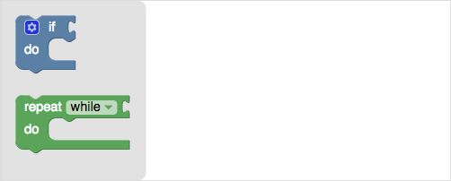
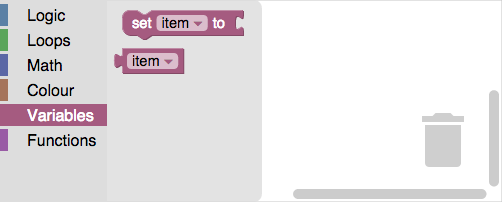
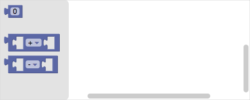

# 工具箱

工具箱表现为侧边菜单，用户可以从中创建新块。使用 XML 或 JSON 指定工具箱的结构。 当该工具箱定义被注入到页面中时，它将被传递给 Blockly。

::: tip 提示
有关如何自定义工具箱的更多信息，请参见 [自定义块状工具箱代码实验室](https://blocklycodelabs.dev/codelabs/custom-toolbox/index.html?index=..%2F..index#0)。
:::

## XML

如果使用 XML，则可以使用节点树或字符串形式创建工具箱。 如果您不喜欢手动输入 XML，建议您使用 [Blockly Developer Tools](https://developers.google.com/blockly/guides/create-custom-blocks/blockly-developer-tools.html)。 使用它，您可以构造一个工具箱并使用可视化界面自动生成其工具箱 XML。

这是一个使用节点树的最小示例：

```XML
<xml id="toolbox" style="display: none">
  <block type="controls_if"></block>
  <block type="controls_whileUntil"></block>
</xml>
<script>
  var workspace = Blockly.inject('blocklyDiv',
      {toolbox: document.getElementById('toolbox')});
</script>
```

以下是使用字符串形式的相同示例：

```HTML
<script>
  var toolbox = '<xml>';
  toolbox += '  <block type="controls_if"></block>';
  toolbox += '  <block type="controls_whileUntil"></block>';
  toolbox += '</xml>';
  var workspace = Blockly.inject('blocklyDiv', {toolbox: toolbox});
</script>
```

## JSON

从[2020年9月的发布版本](https://github.com/google/blockly/releases/tag/3.20200924.0)开始，还可以使用 JSON 定义工具箱。

上述示例使用 JSON 表示：

```json
{
  "kind": "flyoutToolbox",
  "contents": [
    {
      "kind": "block",
      "type": "controls_if"
    },
    {
      "kind": "block",
      "type": "controls_whileUntil"
    }
  ]
}
```

::: warning 警告
如果用户决定使用 **blockxml** 定义块（有关 **blockxml** 的更多信息，请参见下面的 [文档](/guides/configure/toolbox#json_2.html)），当用户第一次打开包含超过 100 个块的分类时，由于从字符串到 xml 到 block 的转换开销，将会对性能产生影响。我们计划在不久的将来重新审视此事。
:::

以上所有示例均使用两个块创建相同的工具箱：



如果存在少量块，则可以显示它们而没有任何分类（如上面的最小示例中所示）。在此简单模式下，所有可用块都显示在工具箱中，主工作区上没有滚动条，并且不需要垃圾桶。

## 分类

工具箱中的块可以按分类组织。这里有两个类别（'Control' 和 'Logic'），每个类别包含三个块：

:::: tabs
::: tab XML
```XML
<xml id="toolbox" style="display: none">
  <category name="Control">
    <block type="controls_if"></block>
    <block type="controls_whileUntil"></block>
    <block type="controls_for">
  </category>
  <category name="Logic">
    <block type="logic_compare"></block>
    <block type="logic_operation"></block>
    <block type="logic_boolean"></block>
  </category>
</xml>
```
:::
::: tab JSON
```json
{
  "kind": "categoryToolbox",
  "contents": [
    {
      "kind": "category",
      "name": "Control",
      "contents": [
        {
          "kind": "block",
          "type": "controls_if"
        },
        {
          "kind": "block",
          "type": "controls_whileUntil"
        },
        {
          "kind": "block",
          "type": "controls_for"
        }
      ]
    },
    {
      "kind": "category",
      "name": "Logic",
      "contents": [
        {
          "kind": "block",
          "type": "logic_compare"
        },
        {
          "kind": "block",
          "type": "logic_operation"
        },
        {
          "kind": "block",
          "type": "logic_boolean"
        }
      ]
    }
  ]
}
```
:::
::::

下面是生成的工具箱，单击 'Logic' 类别，以便可以看到弹出窗口中的三个逻辑块：


分类的存在改变了 Blockly 的 UI 以支持更大的应用程序。出现滚动条，允许无限大的工作空间。上下文菜单包含更多高级选项，例如添加注释或折叠块。使用 [配置选项](/guides/get-started.html#配置.html) 可以覆盖所有这些功能。

### 访问分类

可以使用分类的 id 从工具箱中检索类别。 分类 id 可以在定义工具箱时定义。

设置分类的 id：

:::: tabs
::: tab XML
```xml
<category name="..." toolboxitemid="categoryId"></category>
```
:::
::: tab JSON
```json
{
  "kind": "category",
  "name": "...",
  "toolboxitemid": "categoryId"
}
```
:::
::::

从工具箱访问分类：

```javascript
var category = toolbox.getToolboxItemById('categoryId');
```

### 颜色

可以使用可选的 `colour` 属性为每个分类分配一种颜色。 请注意英式拼写。`colour` 的值是定义色调的数字（0-360）。

:::: tabs
::: tab XML
```xml
<xml id="toolbox" style="display: none">
  <category name="Logic" colour="210">...</category>
  <category name="Loops" colour="120">...</category>
  <category name="Math" colour="230">...</category>
  <category name="Colour" colour="20">...</category>
  <category name="Variables" colour="330" custom="VARIABLE"></category>
  <category name="Functions" colour="290" custom="PROCEDURE"></category>
</xml>
```
:::
::: tab JSON
```json
{
  "contents": [
    {
      "kind": "category",
      "name": "Logic",
      "colour": "210"
    },
    {
      "kind": "category",
      "name": "Loops",
      "colour": "120"
    }
  ]
}
```
:::
::::

该颜色显示为分类左侧的矩形，并作为当前所选类别的高亮色：



### 主题

如果您已经开始使用 Blockly 主题，那么您将需要添加 `categorystyle` 属性而不是 `colour` 属性，如下所示。

:::: tabs
::: tab XML
```xml
<category name="Logic" categorystyle="logic_category">
</category>
```
:::
::: tab JSON
```json
{
  "kind": "category",
  "name": "Logic",
  "categorystyle": "logic_category"
}
```
:::
::::

有关主题的更多信息，请查看 [主题](/guides/configure/themes.html)。

### 分类 CSS

我们提供了一种通过 JSON 和 XML 工具箱定义来自定义一个分类上不同的类的方法。 以下 CSS 类可以被改变。

- container - 分类父级 div 的类。默认为 `blocklyToolboxCategory`。

- row - 包含分类标签和图表组的 div 类. 默认为 `blocklyTreeRow`。

- icon - 分类图标的类。默认为 `blocklyTreeIcon`。

- label - 分类标签的类。 默认为 `blocklyTreeLabel`。

- selected - 分类被选中时添加的类。 默认为 `blocklyTreeSelected`。

- openicon - 当嵌套的分类打开时被添加的类。默认为 `blocklyTreeIconOpen`。

- closedicon - 当嵌套的分类关闭时被添加的类。 默认为 `blocklyTreeIconClosed`。

这些中的任何一个都可以使用 XML 或 JSON 进行设置。 在 XML 中，只需在上面的名称之一前面加上 “css-” 即可更改类。

:::: tabs
::: tab XML
```xml
<category name="..." css-container="yourClassName"></category>
```
:::
::: tab JSON
```json
{
  "kind": "category",
  "name": "...",
  "cssConfig": {
    "container": "yourClassName"
  }
}
```
:::
::::

### 禁用某个分类

禁用某个分类将不允许用户点击该分类，如果用户使用键盘操作工具箱，则将跳过该分类。 在 `blocklyToolboxCategory` div 上设置的 CSS 属性可让您控制已禁用分类的外观，如下所示。

```javascript
var category = toolbox.getToolboxItems()[0];
category.setDisabled('true');
```

```html
<style>
  .blocklyToolboxCategory[disabled="true"] {
    opacity: .5;
  }
</style>

```

### 显示/隐藏分类

分类可以在首次注入工具箱时隐藏，也可以在之后通过 JavaScript 隐藏。

:::: tabs
::: tab XML
```xml
<category name="..." hidden="true"></category>
```
:::
::: tab JSON
```json
{
  "kind": "category",
  "name": "...",
  "hidden": "true"
}
```
:::
::: tab JavaScript
```javascript
var category = toolbox.getToolboxItems()[0];
category.hide();
```
:::
::::
## 动态分类

有两种具有特殊行为的分类。变量和函数分类被定义为没有内容，但其具有 `custom` 属性分别为 `VARIABLE` 或 `PROCEDURE`。这些分类将使用适当的块自动填充。

:::: tabs
::: tab XML
```xml
<category name="Variables" custom="VARIABLE"></category>
<category name="Functions" custom="PROCEDURE"></category>
```
:::
::: tab JSON
```json
{
  "kind": "category",
  "name": "Variables",
  "custom": "VARIABLE"
},
{
  "kind": "category",
  "name": "Functions",
  "custom": "PROCEDURE"
}
```
:::
::::

*注意：在整个 Blockly 代码库中都使用了“过程”一词，但是此后发现“函数”一词更容易为学生所理解。 抱歉没能匹配。*

开发人员还可以使用 `custom` 属性创建动态填充的弹出分类。例如，要创建带有一组自定义色块的弹出按钮，请执行以下操作：

- 使用自定义属性创建分类。

  ```xml
  <category name="Colours" custom="COLOUR_PALETTE"></category>
  ```

- 定义一个回调以提供分类的内容。 此回调应接收工作空间并返回 XML 块元素的数组。

  ```JavaScript
  /**
   * Construct the blocks required by the flyout for the colours category.
   * @param {!Blockly.Workspace} workspace The workspace this flyout is for.
   * @return {!Array.<!Element>} Array of XML block elements.
   */
  myApplication.coloursFlyoutCallback = function(workspace) {
    // Returns an array of hex colours, e.g. ['#4286f4', '#ef0447']
    var colourList = myApplication.getPalette();
    var xmlList = [];
    if (Blockly.Blocks['colour_picker']) {
      for (var i = 0; i < colourList.length; i++) {
        var blockText = '<block type="colour_picker">' +
            '<field name="COLOUR">' + colourList[i] + '</field>' +
            '</block>';
        var block = Blockly.Xml.textToDom(blockText);
        xmlList.push(block);
      }
    }
    return xmlList;
  };
  ```
- 在工作区上注册回调。

  ```javascript
  myWorkspace.registerToolboxCategoryCallback(
    'COLOUR_PALETTE', myApplication.coloursFlyoutCallback);
  ```

### 类型化变量

如果使用类型化变量，则需要将变量类型添加到变量字段中。

```xml
<block type="vars_set">
  <field name="VAR_SET" variabletype="panda"></field>
</block>
```
## 分类树

分类可以嵌套在其他分类中。这里有两个顶级分类（'Core' 和 'Custom'），每个分类包含两个子分类，每个子类别包含块：

:::: tabs
::: tab XML
```xml
<xml id="toolbox" style="display: none">
  <category name="Core">
    <category name="Control">
      <block type="controls_if"></block>
      <block type="controls_whileUntil"></block>
    </category>
    <category name="Logic">
      <block type="logic_compare"></block>
      <block type="logic_operation"></block>
      <block type="logic_boolean"></block>
    </category>
  </category>
  <category name="Custom">
    <block type="start"></block>
    <category name="Move">
      <block type="move_forward"></block>
      <block type="move_backward"></block>
    </category>
    <category name="Turn">
      <block type="turn_left"></block>
      <block type="turn_right"></block>
    </category>
  </category>
</xml>
```
:::
::: tab JSON
```json
{
  "kind": "categoryToolbox",
  "contents": [
    {
      "kind": "category",
      "name": "Core",
      "contents": [
        {
          "kind": "category",
          "name": "Control",
          "contents": [
            {
              "kind": "block",
              "type": "controls_if"
            },
            {
              "kind": "block",
              "type": "controls_whileUntil"
            }
          ]
        },
        {
          "kind": "category",
          "name": "Logic",
          "contents": [
            {
              "kind": "block",
              "type": "logic_compare"
            },
            {
              "kind": "block",
              "type": "logic_operation"
            },
            {
              "kind": "block",
              "type": "logic_boolean"
            }
          ]
        }
      ]
    },
    {
      "kind": "category",
      "name": "Custom",
      "contents": [
        {
          "kind": "block",
          "type": "start"
        },
        {
          "kind": "category",
          "name": "Move",
          "contents": [
            {
              "kind": "block",
              "type": "move_forward"
            },
            {
              "kind": "block",
              "type": "move_backward"
            }
          ]
        },
        {
          "kind": "category",
          "name": "Turn",
          "contents": [
            {
              "kind": "block",
              "type": "turn_left"
            },
            {
              "kind": "block",
              "type": "turn_right"
            }
          ]
        }
      ]
    }
  ]
}
```
:::
::::

请注意，分类可以包含子分类和块。在上面的例子中，'Custom' 有两个子分类（'Move' 和 'Turn'），以及它自己的一个块（'start'）。

## 展开

默认情况下，当 Blockly 被加载时，分类会以折叠方式显示，但分类可以用以下方式展开：

:::: tabs
::: tab XML
```xml
<category name="..." expanded="true"></category>
```
:::
::: tab JSON
```json
{
  "kind": "category",
  "name": "...",
  "expanded": "true"
}
```
:::
::::


## 预设块

工具箱定义可以包含将字段设置为默认值的块，或者包含已经连接在一起的块。

下面是四个块：
1. 一个简单的无预设值的 `logic_boolean` 块：

    

2. 经过修改以显示数字 42 而不是默认值 0 的 `math_number` 块：

    


3. 一个 `controls_for` 块，具有三个与之相连的 `math_number` 块：

    

4. 一个 `math_arithmetic` 块，其中连接了两个 `math_number` [影子块](/guides/configure/toolbox#影子块.html)：

    

以下是在工具箱中生成这四个块的代码：
```HTML
<xml id="toolbox" style="display: none">
  <block type="logic_boolean"></block>

  <block type="math_number">
    <field name="NUM">42</field>
  </block>

  <block type="controls_for">
    <value name="FROM">
      <block type="math_number">
        <field name="NUM">1</field>
      </block>
    </value>
    <value name="TO">
      <block type="math_number">
        <field name="NUM">10</field>
      </block>
    </value>
    <value name="BY">
      <block type="math_number">
        <field name="NUM">1</field>
      </block>
    </value>
  </block>

  <block type="math_arithmetic">
    <field name="OP">ADD</field>
    <value name="A">
      <shadow type="math_number">
        <field name="NUM">1</field>
      </shadow>
    </value>
    <value name="B">
      <shadow type="math_number">
        <field name="NUM">1</field>
      </shadow>
    </value>
  </block>
</xml>
```
这些预设或连接块的 XML 与 Blockly 的 XML 保存格式相同。 因此，为此类块构造 XML 的最简单方法是使用 [代码应用程序](https://blockly-demo.appspot.com/static/demos/code/index.html) 来构建块，然后切换到 XML 选项卡并复制结果。 `x`，`y` 和 `id` 属性将被工具箱忽略，并且可能会被删除。

### JSON

可以使用 `blockxml` 属性在 JSON 中指定预设块和连接块。 有关应使用什么 XML 字符串的更多信息，请查看 [上面的部分](/guides/configure/web/toolbox#预设块.html)。

```json
{
  "kind": "block",
  "blockxml": "<block type='math_number'><field name='NUM'>42</field></block>"
}
```

仅在更改字段值或将块连接在一起时才需要。 如果您不需要执行上述任何一项操作，则可以简单地使用 `type`。

```json
{
  "kind": "block",
  "type": "math_number"
}
```

## 影子块

影子块是执行以下功能的占位符块：

- 它们指示其父块的默认值。

- 它们允许用户直接键入值，而无需获取数字或字符串块。

- 与常规块不同，如果用户在其上放置块，则会替换它们。

- 它们告知用户预期的值类型。

无法使用代码应用程序直接构造影子块。 相反，可以使用常规块，然后将XML中的 `<block ...>` 和 `</ block>` 更改为 `<shadow ...>` 和 `</ shadow>`。

::: tip 注意
影子块可能不包含变量字段或具有不是影子块的子项。
:::

## 变量

大多数字段都很容易在工具箱中设置，只需要 `name` 属性及其 `value`。
```xml
<field name="NUM">1</field>
```
但是，变量具有其他可选属性，这些属性会影响变量的创建方式。 变量字段可以具有 `id` 和 `variabletype`。 请注意，`variabletype` 不使用 camelCase(驼峰式命名)。

```xml
<field name="VAR" id=".n*OKd.u}2UD9QFicbEX" variabletype="Panda">Bai Yun</field>
```
如果设置了 `id`，则在创建块时，`variabletype`（如果已设置）和 `value` 必须与具有该 `id` 的任何现有变量匹配。 如果不存在具有该 `id` 的变量，则将创建一个新变量。 通常，该 `id` 不应包含在您的工具箱 XML 中。 如果变量具有相同的 `value` 和 `variabletype`，则省略 `id` 可使变量引用现有变量。

果设置了 `variabletype`，则将使用该类型创建变量。 如果未设置 `variabletype`，则变量将具有默认的 `''` 类型。 如果使用 `variabletype`，则必须设置变量类型，因为 Blockly 不会推断类型。

→ 更多信息请参阅 [变量](/guides/create-custom-blocks/variables.html)。

## 分隔符

Adding a separator between any two categories will create a line and extra space between the two categories.

You can change the class for the separator in your JSON or XML toolbox definition.

在任何两个分类之间添加分隔符将在这两个类别之间创建一行并留出额外的空间。

您可以在 JSON 或 XML 工具箱定义中更改分隔符的类。

:::: tabs
::: tab XML
```xml
<sep css-container="yourClassName"></sep>
```
:::
::: tab JSON
```json
{
  "kind": "sep",
  "cssConfig": {
    "container": "yourClassName"
  }
}
```
:::
::::


在任意两个块之间添加分隔符将在两个块之间创建间隙。 默认情况下，每个块与其下相邻块相距 24 个像素。 可以使用 'gap' 属性更改此间距，该属性将替换默认间距。

:::: tabs
::: tab XML
```xml
<xml id="toolbox" style="display: none">
  <block type="math_number"></block>
  <sep gap="32"></sep>
  <block type="math_arithmetic">
    <field name="OP">ADD</field>
  </block>
  <sep gap="8"></sep>
  <block type="math_arithmetic">
    <field name="OP">MINUS</field>
  </block>
</xml>
```
:::
::: tab JSON
```json
{
  "kind": "flyoutToolbox",
  "contents": [
    {
      "kind": "block",
      "type":"math_number"
    },
    {
      "kind": "sep",
      "gap": "32"
    },
    {
      "kind": "block",
      "blockxml": "<block type='math_arithmetic'><field name='OP'>ADD</field></block>"
    },
    {
      "kind": "sep",
      "gap": "8"
    },
    {
      "kind": "block",
      "blockxml": "<block type='math_arithmetic'><field name='OP'>MINUS</field></block>"
    }
  ]
}
```
:::
::::


调整块之间的间距可以允许在工具箱中创建逻辑组的块。



## 按钮和标签

您可以在工具箱中可以放置块的任何地方放置按钮或标签。

:::: tabs
::: tab XML
```xml
<xml id="toolbox" style="display: none">
  <block type="logic_operation"></block>
  <label text="A label" web-class="myLabelStyle"></label>
  <label text="Another label"></label>
  <block type="logic_negate"></block>
  <button text="A button" callbackKey="myFirstButtonPressed"></button>
  <block type="logic_boolean"></block>
</xml>
```
:::
::: tab JSON
```json
{
  "kind": "flyoutToolbox",
  "contents": [
    {
      "kind": "block",
      "type":"logic_operation"
    },
    {
      "kind": "label",
      "text": "A label",
      "web-class": "myLabelStyle"
    },
    {
      "kind": "label",
      "text": "Another label"
    },
    {
      "kind": "block",
      "type": "logic_negate"
    },
    {
      "kind": "button",
      "text": "A button",
      "callbackKey": "myFirstButtonPressed"
    },
    {
      "kind": "block",
      "type": "logic_boolean"
    }
  ]
}
```
:::
::::

```html
    <style>
    .myLabelStyle>.blocklyFlyoutLabelText {
      font-style: italic;
      fill: green;
    }
    </style>
```


您可以指定要应用于按钮或标签的CSS类名称。在上面的示例中，第一个标签使用自定义样式，而第二个标签使用默认样式。

按钮应该有回调函数，而标签不需要。要为给定按钮设置回调函数，使用

```JavaScript
yourWorkspace.registerButtonCallback(yourCallbackKey, yourFunction).
```
您的函数应接受点击的按钮作为参数。 变量类别中的 “创建变量...” 按钮是带有回调的按钮的一个很好的例子。
## 禁用

可以使用可选的 `disabled` 属性单独禁用工具箱中的块：

:::: tabs
::: tab XML
```xml
<xml id="toolbox" style="display: none">
  <block type="math_number"></block>
  <block type="math_arithmetic"></block>
  <block type="math_single" disabled="true"></block>
</xml>
```
:::
::: tab JSON
```json
{
  "kind": "flyoutToolbox",
  "contents": [
    {
      "kind": "block",
      "type":"math_number"
    },
    {
      "kind": "block",
      "type": "math_arithmetic"
    },
    {
      "kind": "block",
      "type": "math_single",
      "disabled": "true"
    }
  ]
}
```
:::
::::


禁用块可用于限制用户的选择。 也许在取得某些成就之后，可以解锁高级块。

```javascript
Blockly.selected.setEnabled(true);
```


## 更改工具箱
应用程序可以通过单个函数调用随时更改工具箱中可用的块：
```JavaScript
workspace.updateToolbox(newTree);
```
与初始配置期间的情况一样，`newTree` 可以是节点树或字符串表达或 JSON 对象。唯一的限制是不能更改模式;也就是说，如果最初定义的工具箱中有分类，则新工具箱也必须具有分类（尽管分类可能会更改）。同样，如果最初定义的工具箱没有任何分类，则新工具箱可能没有任何分类。

可以通过以下方式更新单个分类的内容：

```javascript
var category = toolbox.getToolboxItems()[0];
category.updateFlyoutContents(flyoutContents);
```

其中 flyoutContents 可以是使用 JSON 定义的块列表，节点树或字符串表达。

请注意，此时更新工具箱会导致一些次要的 UI 重置：

- 在没有类别的工具箱中，用户更改的任何字段（例如下拉列表）将恢复为默认值。

这是一个包含分类和块组的分类树 [在线示例](https://blockly-demo.appspot.com/static/demos/toolbox/index.html)。