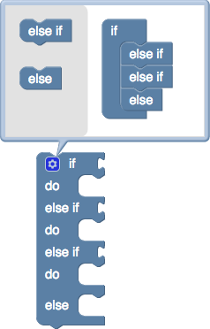

# 扩展和变形

高级模块可以使用扩展名或变形器，使其更具动态性和可配置性。

扩展允许将块的程序化配置，额外的初始化或自定义行为添加到块中。例如，几个块 [`parent_tooltip_when_inline`](https://github.com/google/blockly/blob/develop/core/extensions.js) 在连接到另一个块时使用扩展显示其父级的工具提示。

变形器非常类似于扩展。除了更改块之外，它还定义了如何将那些更改保存到 XML 以及如何从 XML 加载。变形器还可以具有其他 UI，供用户配置其状态。在 Blockly 中，最容易识别的变形器是 if 块。


## 扩展

扩展是块的自定义配置或行为，可以通过块的 [JSON定义](/guides/create-custom-blocks/define-blocks.html) 将其应用于块 。使用 `extensions` 键添加块的扩展名。多个扩展可以应用于单个块。

```JSON
{
  //...,
  "extensions": ["break_warning_extension", "parent_tooltip_extension"],
}
```

由于扩展执行的工作超出 Blockly 的默认行为，因此必须为所使用的每个平台编写一次扩展。每个平台都包括一个用于向 Blockly 注册扩展的 API。每个扩展都定义了一个在块创建时运行的功能。将扩展名添加到块的“extensions”键后，表示在创建该类型的每个新块时，关联函数应运行一次。

每个扩展必须通过调用 Blockly 库进行注册。

```js
Blockly.Extensions.register('parent_tooltip_extension',
  function() {
    // this refers to the block that the extension is being run on
    var thisBlock = this;
    this.setTooltip(function() {
      var parent = thisBlock.getParent();
      return (parent && parent.getInputsInline() && parent.tooltip) ||
        Blockly.Msg.MATH_NUMBER_TOOLTIP;
    });
  });
```

## 变形器

变形器是在块上提供自定义可序列化状态的唯一方法。使用 “mutator” 键在块的 JSON 定义中声明它们。块上只能声明一个变形器。

变形器是通过在实例化时 [混合](https://en.wikipedia.org/wiki/Mixin) 块中的方法集合以及用于用户配置“变形器”的可选 UI 来实现的。 一个块只能有一组 “变形器” 方法。

```JSON
{
  //...,
  "mutator": "controls_if_mutator",
}
```

变形器最明显的例子是弹出对话框，该对话框允许 `if` 语句获取更多的 `else if` 和 `else` 子句。 但是，并非所有的“变形器”都那么复杂。

::: tip 注意
[blocks-plus-minus 插件](https://github.com/google/blockly-samples/blob/master/plugins/block-plus-minus/README.md) 为核心块实现了备用的 变形器 UI。 如果要实现自己的变形器 UI，则该代码是一个不错的起点。
:::

## 注册变形器

就像 [扩展](/guides/create-custom-blocks/extensions.html) 一样，必须在 Blockly.Extensions 中注册变形器。 Blockly 库提供了一种方便的方法，可以对变形器进行基本验证并处理标准配置。

```js
Blockly.Extensions.registerMutator(
    name, mixinObj, opt_helperFn, opt_blockList);
```

- `name`: JSON 中使用的变形器的字符串名称

- `mixinObj`: 一个包含各种变形方法的对象。

- `opt_helperFn`:  一个可选的辅助函数，将在 mixin 之后在块上运行。

- `opt_blockList`: 一个可选的块列表，用于默认的变形器编辑界面。

## Mixin 对象

Web 上的变形器只是一组在初始化期间混合到块对象中的方法。至少，一个块上的变形器必须添加 `mutationToDom` 并与 `domToMutation` 用于指定如何序列化和反序列化变形状态。使用默认变形器界面进行变形还必须实现 `decompose` 与 `compose` 用于告诉界面如何将块分解为子块以及如何从一组子块进行变形更新。

mixin 对象上的方法将添加到每个块实例中，因此 `this` 可以用于引用块。

### mutationToDom and domToMutation

用于加载、保存、复制和粘贴块的 XML 格式会自动捕获和恢复存储在可编辑字段中的所有数据。但是，如果块包含附加信息，则在保存和重新加载块时，这些信息将丢失。每个块的 XML 都有一个可选的变形器元素，可以在其中存储任意数据。

:::tip 提示
该 mutationToDom 和 domToMutation 方法也可以通过插入标记来使用。更改块的结构而不实现这些方法可能会导致错误。
:::


一个简单的例子是 [math.js](https://github.com/google/blockly/blob/master/blocks/math.js) 的 `math_number_property` 块。默认情况下，它有一个输入：


If the dropdown is changed to "divisible by", a second input appears:

如果下拉列表更改为“可整除”，则会出现第二个输入：


这可以通过使用下拉菜单上的更改处理程序轻松完成。问题是，当这个块是从 XML 创建的（如在工具箱中显示、从工具箱克隆、复制和粘贴、复制或从保存的文件加载时），init 函数将在其默认的单输入中构建块形状。如果 XML 指定某个其他块需要连接到不存在的输入，则这会导致错误。

解决这个问题只需要向变形器元素写一个注解，记录这个块有一个额外的输入：

```xml
<block type="math_number_property">
  <mutation divisor_input="true"></mutation>
  <field name="PROPERTY">DIVISIBLE_BY</field>
</block>
```

保存变形数据是通过向 mixinObj 添加一个 `mutationToDom` 函数来完成的。这是 `math_number_property`块中的示例：

```javascript
mutationToDom: function() {
  var container = document.createElement('mutation');
  var divisorInput = (this.getFieldValue('PROPERTY') == 'DIVISIBLE_BY');
  container.setAttribute('divisor_input', divisorInput);
  return container;
}
```

每当将块写入 XML 时都会调用此函数。如果该函数不存在或返回 null，则不会记录任何突变。如果该函数存在并返回一个 “mutation” XML 元素，则该元素（以及任何属性或子元素）将存储在块的 XML 表示形式的开头。

`domToMutation` 每当从 XML 恢复块时都会调用逆函数。这是 `math_number_property` 块中的示例：

```javascript
domToMutation: function(xmlElement) {
  var hasDivisorInput = (xmlElement.getAttribute('divisor_input') == 'true');
  this.updateShape_(hasDivisorInput);  // Helper function for adding/removing 2nd input.
}
```

如果此函数存在，则会传递块的 “变形” XML 元素。该函数可以解析元素并基于元素的属性和子元素重新配置块。

### 组合和分解

变形对话框允许用户将一个块分解成更小的子块并重新配置它们，从而改变原始块的形状。如果 mixinObj 上定义了 `compose` 和 `decompose` 方法，则对话框按钮和默认编辑界面元素将添加到块中。如果两者都未定义，则不会创建变形器的界面，但事件或其他代码仍可能导致更改。仅定义这两个函数之一是错误的。


See [Mutator editing UI](/guides/create-custom-blocks/extensions.html#mutator_editing_ui) for more details on the editing UI.

有关编辑器界面的更多详细信息，请参阅 [变形器编辑界面](#变形器编辑界面)。

当一个变形器对话框打开时，块的 `decompose` 函数被调用来填充变形器的工作区。

```javascript
decompose: function(workspace) {
  var topBlock = workspace.newBlock('controls_if_if');
  topBlock.initSvg();
  ...
  return topBlock;
}
```

至少这个函数必须为变形器对话框创建和初始化一个顶级块，并返回它。此函数还应使用任何合适的子块填充此顶级块。

当变形器对话框保存其内容时，块的`compose` 函数将被调用以根据新设置修改原始块。

```javascript
compose: function(topBlock) {
  ...
}
```

这个函数将从顶级块的变形器工作区（与 compose 函数创建和返回的块相同）传递下来。通常这个函数会爬取附加到顶级块的子块，然后更新相应地原始块。



### saveConnections

Ideally the `compose` function would ensure that any blocks already connected to the original block remain connected to the correct inputs, even if the inputs are reordered. To do this, define a `saveConnections` method on your `mixinObj`:

```javascript
/**
 * Store pointers to any connected child blocks.
 * @param {!Blockly.Block} containerBlock Root block in mutator.
 * @this {Blockly.Block}
 */
saveConnections: function(containerBlock) {
  ...
}
```

If `saveConnections` is defined, the mutator will call it before compose.

## Helper function

Along with the mixin a mutator may register a helper function. This function is run on the block after it is instantiated and the mixinObj is added and can be used to add additional triggers or effects to a mutation.

One example is the `math_is_divisibleby_mutator` in the [math blocks](https://github.com/google/blockly/blob/develop/blocks/math.js) which checks the dropdown and updates the block to have the correct number of inputs.

```javascript
Blockly.Constants.Math.IS_DIVISIBLE_MUTATOR_EXTENSION = function() {
  this.getField('PROPERTY').setValidator(function(option) {
    var divisorInput = (option == 'DIVISIBLE_BY');
    this.sourceBlock_.updateShape_(divisorInput);
  });
};

Blockly.Extensions.registerMutator('math_is_divisibleby_mutator',
  Blockly.Constants.Math.IS_DIVISIBLEBY_MUTATOR_MIXIN,
  Blockly.Constants.Math.IS_DIVISIBLE_MUTATOR_EXTENSION);
```

## 变形器编辑界面

The mutator also needs UI if the user should be able to edit the block's shape. The easiest way to add this is to implement [`compose` and `decompose`](/guides/create-custom-blocks/extensions.html#compose_and_decompose) in your mixin and optionally provide a list of blocks to include in the default editor.

```javascript
    Blockly.Extensions.registerMutator('controls_if_mutator',
      Blockly.Constants.Logic.CONTROLS_IF_MUTATOR_MIXIN, null,
      ['controls_if_elseif', 'controls_if_else']);
```

In this case, Blockly will use the default mutator UI and allow the user to add controls_if_elseif and controls_if_else blocks to the stack returned by [`decompose`](/guides/create-custom-blocks/extensions.html#compose_and_decompose).


### Custom editor UIs

If your app uses a custom mutator UI, you can also use the `opt_helperFn` to set the custom editor UI on the block with the `setMutator` method.

```javascript
    // declare the helper function
    var myMutatorFn = function() {
      // this will refer to the block
      this.setMutator(new MyMutator(...));
    };
    //...
    // register the mutator along with the helper function
    Blockly.Extensions.registerMutator('my_mutator', MY_MUTATOR_MIXIN,
      myMutatorFn, null);
```


The `setMutator` function takes one argument, a new Mutator. The default mutator used by Blockly is implemented in [mutator.js](https://github.com/google/blockly/blob/master/core/mutator.js).