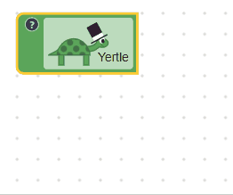

<!--
 * @Date: 2021-04-07 14:21:15
 * @LastEditors: tortorse
 * @LastEditTime: 2021-10-27 09:49:28
 * @FilePath: \blockly-document-chinese\docs\guides\create-custom-blocks\fields\anatomy-of-a-field.md
-->
# 字段解析

## 值

所有字段都必须有一个值，这是字段数据的真实来源。这可以是任何类型（字符串、数字、数组、日期等）。字段可以使用验证器来限制值或转换为机器可读格式（例如规范化日期格式）。

## 文本

所有字段都包含文本，它是一个简单的人类可读字符串，表示字段的值。这并不一定意味着它们是相同的。例如，布尔字段上的文本可能是“开”或“关”，而其值为“真”或“假”。

此文本是在块折叠时显示的内容，用于可访问性，并且可以选择作为[块上显示](#块上显示)的一部分。

## 可编辑与不可编辑字段

通常，可编辑字段允许用户更改代码，而非可编辑字段向用户显示有关块的信息。单击可编辑字段时可能会显示丰富的编辑器。

可编辑的字段包括：

- [复选框](/guides/create-custom-blocks/fields/built-in-fields/checkbox.html)

- [颜色](/guides/create-custom-blocks/fields/built-in-fields/colour.html)

- [下拉菜单](/guides/create-custom-blocks/fields/built-in-fields/dropdown.html)

- [数字](/guides/create-custom-blocks/fields/built-in-fields/number.html)

- [文本输入](/guides/create-custom-blocks/fields/built-in-fields/text-input.html)

不可编辑的字段包括：

- [标签](/guides/create-custom-blocks/fields/built-in-fields/label.html)

- [序列化标签](/guides/create-custom-blocks/fields/built-in-fields/label-serializable.html)

- [图片](/guides/create-custom-blocks/fields/built-in-fields/image.html)

## 序列化

可序列化字段的值以 XML 保存格式进行编码。所有可编辑字段都是可序列化的，因为它们的值是动态的。不可编辑字段的值通常不是动态的，因此它们通常不会被序列化。

序列化字段包括：

- [复选框](/guides/create-custom-blocks/fields/built-in-fields/checkbox.html)

- [颜色](/guides/create-custom-blocks/fields/built-in-fields/colour.html)

- [下拉菜单](/guides/create-custom-blocks/fields/built-in-fields/dropdown.html)

- [数字](/guides/create-custom-blocks/fields/built-in-fields/number.html)

- [文本输入](/guides/create-custom-blocks/fields/built-in-fields/text-input.html)

- [序列化标签](/guides/create-custom-blocks/fields/built-in-fields/label-serializable.html)

非序列化字段包括:

- [标签](/guides/create-custom-blocks/fields/built-in-fields/label.html)

- [图片](/guides/create-custom-blocks/fields/built-in-fields/image.html)

请注意序列化标签字段不可编辑，但可序列化。这意味着它只能以编程方式进行编辑，而不是通过用户可见的 UI。编辑后，其值将编码入生成的 XML 中。

## 代码生成

除了连接和断开块之外，字段是用户可以控制 Blockly 生成的代码的唯一方式。字段提供的编辑器允许用户修改字段存储的值。然后块的生成器可以访问字段的值以在生成的代码中使用。

有关在生成器中使用字段值的更多信息，请参阅 [收集参数 > getFieldValue](/guides/create-custom-blocks/generating-code.html#getfieldvalue)。

## 块上显示

字段的块上显示是表示字段值的 SVG 元素的集合。它们占用块上的空间，并且当它们改变大小时，它们迫使块改变大小。一个字段的块上显示可以是简单的也可以是复杂的，这取决于它的需要。

这些是不同的块上显示的一些示例，按复杂性增加的顺序排列。

| 字段类型 | 描述 |
| ---------- | ----------- |
| 标签 | 仅包含一个文本元素。 |
| 角度 | 包含背景矩形、文本元素和度数符号。 |
| 龟 | 包含背景矩形、文本元素和许多用于构造海龟图形的 SVG 元素。 |

## 编辑器显示

当用户单击可编辑字段时，该字段可能会显示任意复杂的编辑器。

这些是不同编辑器的一些示例，按复杂性递增的顺序排列。

| 字段类型 | 描述 |
| ---------- | ----------- |
| 复选框 | 单击时没有编辑器。块上显示更新。 |
| 数字输入 | 文本编辑器覆盖在块显示上方。用户可以打字；编辑器可能会更改颜色以指示错误值。|
| 角度选择器 | 角度选择器既有用于输入数字的文本编辑器，也有用于直观选择角度的可拖动编辑器。 |

## 其他显示方式

折叠模式：用户折叠块。块使用各个字段返回的文本显示其值的文本表示。

无障碍模式：用户可能正在使用屏幕阅读器或类似技术与 Blockly 交互。可以向用户读出该字段的文本。