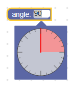
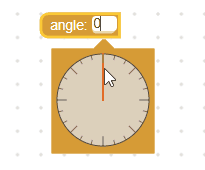
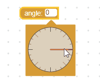
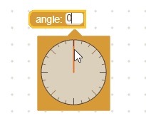
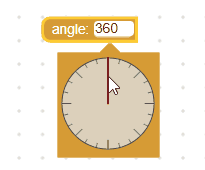

# Angle fields

An angle field stores a number as its value, and a string as its text. Its value is a number between 0 and 360 (this range can be [changed](#range)), while its text could be any string entered into its editor.

#### Angle field


#### Angle field with editor



#### Collapsed angle field


## Creation

::::tabs
::: tab JSON

```json
{
  "type": "example_angle",
  "message0": "angle: %1",
  "args0": [
    {
      "type": "field_angle",
      "name": "FIELDNAME",
      "angle": 90
    }
  ]
}
```

:::
::: tab JavaScript

```javascript
Blockly.Blocks['example_angle'] = {
  init: function() {
    this.appendDummyInput()
      .appendField('angle:')
      .appendField(new Blockly.FieldAngle(90), 'FIELDNAME');
  }
};
```

:::
::::

The angle constructor takes in an optional value and an optional [validator](#creating_an_angle_validator). Zero is used as the default value if no value is given or the given value does not cast to a number.

## Serialization

:::: tabs
::: tab JSON

The JSON for an angle field looks like so:

```json
{
  "fields": {
    "FIELDNAME": 0
  }
}
```

Where `FIELDNAME` is a string referencing an angle field, and the value is the value to apply to the field. The value follows the same rules as the constructor value.
:::
::: tab XML

The XML for an angle field looks like so:

```xml
<field name="FIELDNAME">0</field>
```

Where the `name` attribute contains a string referencing an angle field, and the inner text is the value to apply to the field. The inner text value follows the same rules as the constructor value.

:::
::::

## Customization

### Snapping

The `Blockly.FieldAngle.ROUND` property changes what values the angle picker "snaps" to when using a mouse.

::: tip
Note: This does not affect the text input portion of the angle field, so if you want to ensure that the angle value is rounded, use a [validator](#creating_an_angle_validator).
:::

Here is an example with a `ROUND` value of 70:


Angle field with a ROUND value of 70

The `ROUND` property defaults to 15. Set it to 0 if you want to disable snapping.

This is a global property, so it will modify all angle fields when set.

### Directionality

The `Blockly.FieldAngle.CLOCKWISE` property changes which direction makes the angle value increase. Setting this value to `true` makes the angle increase as the selector is moved clockwise, setting it to `false` makes the angle increase as it is moved counter-clockwise.

#### CLOCKWISE set to true



#### CLOCKWISE set to false


The `CLOCKWIS` Eproperty defaults to `false`, meaning counter-clockwise motion will make the angle increase.

This is a global property, so it will modify all angle fields when set.

### Zero position

The `Blockly.FieldAngle.OFFSET` property sets where 0 degrees is located. By default zero degrees is aligned with the positive x-axis (towards the right) and then this property "offsets" that position by a number of degrees.

:::tip
Note: The direction of the offsetting is always counter clockwise, independent of the [CLOCKWISE](#directionality) property.
:::


The `OFFSET` property defaults to 0, meaning zero degrees is aligned with the positive x-axis.

This is a global property so it will modify all angle fields when set.

### Range

The `Blockly.FieldAngle.WRAP` property sets the range of values. The range of values is equal to `(-360 + WRAP, WRAP)`. This means that a `WRAP` value of 360 will give a range of `(0, 359.9)` and a `WRAP` value of 180 will give a range of `(-179.9, 180)`.


The `WRAP` property defaults to 360, meaning the range of the field is `(0, 359.9)`.

This is a global property so it will modify all angle fields when set.

### Angle picker size

The `Blockly.FieldAngle.HALF` property changes the size of the angle picker. This value defines the radius of the outer circle in pixels.


The `HALF` property defaults to 50.

This is a global property so it will modify all angle fields when set.

:::tip
Note: The size of the angle picker is not affected by the scale of the workspace.
:::

## Common modes

The [direction](#directionality) and [zero position](#zero_position) can be used together to create some fun combinations. Here are two common ones:

### Protractor

0 degrees is right, 90 degrees is up.

```javascript
Blockly.FieldAngle.CLOCKWISE = false;
Blockly.FieldAngle.OFFSET = 0;
```



### Compass

0 degrees is up, 90 degrees is right.

```javascript
Blockly.FieldAngle.CLOCKWISE = true;
Blockly.FieldAngle.OFFSET = 90;
```



## Creating an angle validator

:::tip
Note: For information on validators in general see Validators.
:::
An angle field's value is a number, so any validators must accept a number and return a number, `null`, or `undefined`.

Here is an example of a validator that forces the value to be a multiple of 30:

```javascript
function(newValue) {
return Math.round(newValue / 30) \* 30;
}
```



Note how the angle field's [ROUND](#snapping) property is still set to 15, so the graphical elements of the field display multiples of 15, rather than 30.
