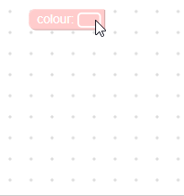

# Colour fields

A colour field stores a string as its `value`, and a string as its `text`. Its `value` is a string with the format `#rrggbb`, while its `text` may be a string with the format `#rgb` if possible.

#### Colour field


#### Colour field with editor open


#### Colour field on collapsed block


## Creation

:::: tabs
::: tab JSON

```json
{
  "type": "example_colour",
  "message0": "colour: %1",
  "args0": [
    {
      "type": "field_colour",
      "name": "FIELDNAME",
      "colour": "#ff4040",
      "colourOptions": [
        "#ff4040",
        "#ff8080",
        "#ffc0c0",
        "#4040ff",
        "#8080ff",
        "#c0c0ff"
      ],
      "colourTitles": [
        "dark pink",
        "pink",
        "light pink",
        "dark blue",
        "blue",
        "light blue"
      ],
      "columns": 3
    }
  ]
}
```

:::
::: tab JavaScript

```javascript
Blockly.Blocks['example_colour'] = {
  init: function() {
    this.appendDummyInput()
      .appendField('colour:')
      .appendField(
        new Blockly.FieldColour('#ff4040', {
          colourOptions: [
            '#ff4040',
            '#ff8080',
            '#ffc0c0',
            '#4040ff',
            '#8080ff',
            '#c0c0ff'
          ],
          colourTitles: [
            'dark pink',
            'pink',
            'light pink',
            'dark blue',
            'blue',
            'light blue'
          ],
          columns: 3
        }),
        'FIELDNAME'
      );
  }
};
```

:::
::::

The colour constructor takes in the following:

- an optional `value`

- an optional [validator](#creating_a_colour_validator)

- an optional map of options, including:

  - `colourOptions`

  - `colourTitles`

  - `columns`

The `value` should be a string in the format `#rrggbb`. If no `value` is given or the given `value` is invalid, the first entry in the default colours array will be used.

The following options can also be set in JSON:

- `colourOptions`

- `colourTitles`

- `columns`

Or they can be set using [JavaScript hooks](#editor_options).

## Serialization

:::: tabs
::: tab JSON
The JSON for a colour field looks like so:

```json
{
  "fields": {
    "FIELDNAME": "#ff0000"
  }
}
```

Where `FIELDNAME` is a string referencing a colour field, and the value is the value to apply to the field. The value follows the same rules as the constructor value.

:::
::: tab XML
The XML for an colour field looks like so:

```xml
<field name="FIELDNAME">#ff0000</field>
```

The `field` node's `name` attribute contains a string referencing a colour field, and the node's inner text is the value to apply to the field. The inner text value follows the same rules as the constructor value.

Note that after being deserialized and reserialized all of the inner text values will be in the format `#rrggbb`. This is sometimes important when diff-ing workspaces.
:::
::::

## Customization

### Editor options

The [setColours](https://developers.google.com/blockly/reference/js/Blockly.FieldColour#setColours) function can be used to set the colour options of a colour field. It takes in an array of colour strings, which must be defined in `#rrggbb` format, and an optional array of tooltips. If the tooltip array is not provided, the default tooltip array will be used.

Tooltips and colours are matched based on array index, not based on value. If the colours array is longer than the tooltip array, the tooltips for the extra colours will be their `#rrggbb` value.

The [setColumns](https://developers.google.com/blockly/reference/js/Blockly.FieldColour#setColours) function sets the number of columns in the colour picker.

:::: tabs
::: tab JSON

```json
{
  "type": "example_colour",
  "message0": "colour: %1",
  "args0": [
    {
      "type": "field_colour",
      "name": "COLOUR",
      "colour": "#ff4040"
    }
  ],
  "extensions": ["set_colours_extension"]
}
```

```javascript
Blockly.Extensions.register('set_colours_extension', function() {
  var field = this.getField('COLOUR');
  field.setColours(
    ['#ff4040', '#ff8080', '#ffc0c0', '#4040ff', '#8080ff', '#c0c0ff'],
    ['dark pink', 'pink', 'light pink', 'dark blue', 'blue', 'light blue']
  );
  field.setColumns(3);
});
```

This is done using a JSON extension.

:::
::: tab JavaScript

```javascript
Blockly.Blocks['example_colour'] = {
  init: function() {
    var field = new Blockly.FieldColour('#ff4040');
    field.setColours(
      ['#ff4040', '#ff8080', '#ffc0c0', '#4040ff', '#8080ff', '#c0c0ff'],
      ['dark pink', 'pink', 'light pink', 'dark blue', 'blue', 'light blue']
    );
    field.setColumns(3);
    this.appendDummyInput()
      .appendField('colour:')
      .appendField(field, 'COLOUR');
  }
};
```

:::
::::


Optionally, the default colours, tooltips, and columns can be overridden globally. This means they will affect all colours fields, rather than a specific field.

```javascript
Blockly.FieldColour.COLOURS = [
  '#ff4040',
  '#ff8080',
  '#ffc0c0',
  '#4040ff',
  '#8080ff',
  '#c0c0ff'
];
Blockly.FieldColour.TITLES = [
  'dark pink',
  'pink',
  'light pink',
  'dark blue',
  'blue',
  'light blue'
];
Blockly.FieldColour.COLUMNS = 3;
```

## Creating a colour validator

:::tip
Note: For information on validators in general see Validators.
:::
A colour field's value is a `#rrggbb` format string, so any validators must accept a `#rrggbb` format string, and return a `#rrggbb` format string, `null`, or `undefined`.

Here is an example of a validator that changes the colour of the block to match the colour of the field.

```javascript
function(newValue) {
  this.getSourceBlock().setColour(newValue);
  return newValue;
}
```

#### Block changing colour based on its colour field


