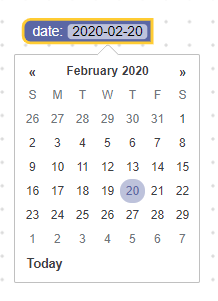

# Date fields

A date field stores a string as its `value`, and a string as its `text`. Its `value` and `text` both have the format `YYYY-MM-DD`.

#### Date field


#### Date field with editor open



#### Date field on collapsed block


:::warning
Warning: The date field is no longer part of the core Blockly library. We now publish it as an npm package named [@blockly/field-date](https://www.npmjs.com/package/@blockly/field-date).
:::

## Creation

::::tabs
::: tab JSON

```json
{
  "type": "example_date",
  "message0": "date: %1",
  "args0": [
    {
      "type": "field_date",
      "name": "FIELDNAME",
      "date": "2020-02-20"
    }
  ]
}
```

:::
::: tab JavaScript

```javascript
Blockly.Blocks['example_date'] = {
  init: function() {
    this.appendDummyInput()
      .appendField('date:')
      .appendField(new Blockly.FieldDate('2020-02-20'), 'FIELDNAME');
  }
};
```

:::
::::

The date field constructor takes in an optional `value` and an optional [validator](#creating-a-date-validator). The `value` should be a string in the format `YYYY-MM-DD`. Otherwise the current (today's) date will be used.

## Serialization and XML

The XML for a date field looks like so:

```xml
<field name="FIELDNAME">2020-02-20</field>
```

The `field` node's `name` attribute contains a string referencing a date field, and the node's inner text is the value to apply to the field. The inner text value follows the same rules as the constructor value.

## Creating a date validator

::: tip
Note: For information on validators in general see Validators.
:::
A date field's value is a `YYYY-MM-DD` format string, so any validators must accept a `YYYY-MM-DD` format string, and return a `YYYY-MM-DD` format string, `null`, or `undefined`.

Note when validating a date it may be useful to use Closure's [date class](https://google.github.io/closure-library/api/goog.date.Date.html).

Here is an example of a validator that only accepts weekdays:

```javascript
function(newValue) {
  var date = goog.date.Date.fromIsoString(newValue);
  var weekday = date.getWeekday();
  if (weekday == 0 || weekday == 6) {
    return null;
  }
  return date.toIsoString(true);
}
```

