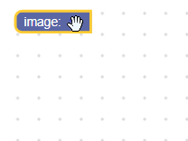

# Image fields

An image field stores a string as its value, and a string as its text. Its value is the src of the image, while its text is an alt string describing/representing the image.

#### Image field


#### Image field on collapsed block


## Creation

:::: tabs
::: tab JSON

```json
{
  "type": "example_image",
  "message0": "image: %1",
  "args0": [
    {
      "type": "field_image",
      "src": "https://www.gstatic.com/codesite/ph/images/star_on.gif",
      "width": 15,
      "height": 15,
      "alt": "*"
    }
  ]
}
```

:::
::: tab JavaScript

```javascript
Blockly.Blocks['example_image'] = {
  init: function() {
    this.appendDummyInput()
      .appendField('image:')
      .appendField(
        new Blockly.FieldImage(
          'https://www.gstatic.com/codesite/ph/images/star_on.gif',
          15,
          15,
          '*'
        )
      );
  }
};
```

:::
::::

The image constructor takes in:

| Parameter          | Description                                                                                                                                                                |
| ------------------ | -------------------------------------------------------------------------------------------------------------------------------------------------------------------------- |
| src                | A string that points to a raster image file.                                                                                                                               |
| width              | Must cast to a non-zero number.                                                                                                                                            |
| height             | Must cast to a non-zero number.                                                                                                                                            |
| opt_alt (Optional) | A string that accurately describes/represents the image. If it is null or undefined an empty string will be used.                                                          |
| opt_onClick        | (Optional) A function to call when the field is clicked.                                                                                                                   |
| opt_flipRtl        | (Optional) A boolean. If true, the image is flipped across the vertical axis when in right-to-left mode. Defaults to false. Useful for "turn left" and "turn right" icons. |

## Serialization

Image fields are not serializable.

## Click handler

:::tip
Note: For information on validators in general see [Validators](/guides/create-custom-blocks/fields/validators.html#校验器).
:::
The image field does not accept a validator; instead it explicitly accepts a function that is called whenever the field is clicked. This means that images can act like buttons that exist on blocks.

The on click handler can be set in the [JavaScript Constructor](#creation) or using the [setOnClickHandler](https://developers.google.com/blockly/reference/js/Blockly.FieldImage#setOnClickHandler) function.

Here is an example of an on click handler that collapses the block when called.

```javascript
function() {
    this.getSourceBlock().setCollapsed(true);
}
```


