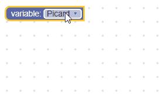

# Variable fields

A variable field stores a string as its value, and a string as its text. The value is an ID of a variable, while the text is the name of a variable.

#### Variable field


#### Variable field with editor open


#### Variable field on collapsed block


## Creation

### Untyped

:::: tabs
::: tab JSON

```json
{
  "type": "example_variable_untyped",
  "message0": "variable: %1",
  "args0": [
    {
      "type": "field_variable",
      "name": "FIELDNAME",
      "variable": "x"
    }
  ]
}
```

:::
::: tab JavaScript

```javascript
Blockly.Blocks['example_variable_untyped'] = {
  init: function() {
    this.appendDummyInput()
      .appendField('variable:')
      .appendField(new Blockly.FieldVariable('x'), 'FIELDNAME');
  }
};
```

:::
::::

### Typed

:::: tabs
::: tab JSON

```json
{
  "type": "example_variable_typed",
  "message0": "variable: %1",
  "args0": [
    {
      "type": "field_variable",
      "name": "FIELDNAME",
      "variable": "x",
      "variableTypes": ["Number", "String"],
      "defaultType": "Number"
    }
  ]
}
```

:::
::: tab JavaScript

```javascript
Blockly.Blocks['example_variable_typed'] = {
  init: function() {
    this.appendDummyInput()
      .appendField('variable:')
      .appendField(
        new Blockly.FieldVariable('X', null, ['Number', 'String'], 'Number'),
        'FIELDNAME'
      );
  }
};
```

:::
::::
The variable constructor takes in an optional variable name, an optional [validator](#creating-a-variable-validator), an optional array of variable types, and an optional default type.

- The **variable name** should be a string. This will be the name of the initial variable the field holds. If it is null or undefined a unique name will be generated.

- The **variable types** should be an array of strings. This tells the field what types of variables the field can hold (i.e. what types of variables to add to the dropdown). If it is null or undefined, all variable types will be accepted (and added to the dropdown).

- The **default type** should be a string. This will be used when creating the field's initial variable model. If this is defined, its should be included in the variable types array. If it is null or undefined this value defaults to an empty string, meaning the initial variable will be flexibly typed.

→ For more information on strict typing, see [Type Checks](/guides/create-custom-blocks/type-checks).

## Serialization

:::: tabs
::: tab JSON
The JSON for a variable field looks like so:

```json
{
  "fields": {
    "FIELDNAME": {
      "id": "QJD^+@[RVIwbLSZoDb:V"
    }
  }
}
```

Where `FIELDNAME` is a string referencing a variable field, and the value is the ID of the variable the field references.

If you are using this field in the toolbox, you can also specify the name and (optional) type directly, since there will be no variable available to reference.

```json
{
  "fields": {
    "FIELDNAME": {
      "name": "my_variable",
      "type": "string"
    }
  }
}
```

:::
::: tab XML
The XML for a variable field looks like so:

```xml
<field name="VARIABLE" id="QJD^+@[RVIwbLSZoDb:V" variabletype="">name</field>
```

- The node's `name` attribute contains a string referencing a variable field.
- The node's `id` attribute contains the ID of the variable the field references.
- The node's `variabletype` attribute contains the type of the variable. The variabletype follows the same rules as the constructor's default type parameter.
- The node's inner text is the name of the variable. The inner text value follows the same rules as the constructor's variable name parameter.
  :::
  ::::

## Creating a variable validator

:::tips
Note: For information on validators in general see Validators.
:::
A variable field's value is a string, so any validators must accept a string and return a string, `null`, or `undefined`.

Here's an example of a validator that only accepts some predefined variables as options. These variables would need to be defined with the [Workspace.createVariable](https://developers.google.com/blockly/reference/js/Blockly.Workspace#createVariable) function when the workspace is loaded.

```javascript
function(newValue) {
  var validIds = ['Worf', 'Riker', 'Picard'];
  if (validIds.indexOf(newValue) == -1) {
    return null;
  }
  return newValue;
}
```


