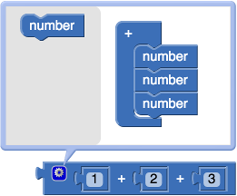

# 自定义块：样式指南

多年来，Blockly 和 Blockly Games 团队已经吸取了许多教训，这些教训适用于开发新积木的人。以下是我们犯过的错误或其他人常见的错误的集合。

这些是我们使用 Blockly 的视觉样式学到的一般课程，可能并不适用于所有用例或设计。存在其他解决方案。这也不是用户可能遇到的问题以及如何避免它们的详尽列表。每种情况都有点不同，并且各有其取舍。

## 1.条件与循环

对于新用户而言，最困难的障碍是条件和循环。 许多基于块的环境将这两个块都归为相同的“控件”类别，并且两个块具有相同的形状和颜色。 当新用户混淆这两个功能块时，这通常会导致挫败感。 Blockly 建议将条件和循环移动到单独的“逻辑”和“循环”分类中，每种分类使用不同的颜色。 这清楚地表明，尽管它们具有相似的形状，但它们是行为不同的独特想法。


*建议：将条件和循环分开。*


## 2.基于 1 的列表

新手程序员在首次遇到从零开始的列表时会做出不良反应。 结果是: Blockly 通过遵循 Lua 和 Lambda Moo 的方式基于 1 创建列表和字符串索引。

为了更高级地使用 Blockly，支持从零开始的列表，以使过渡到文本更加容易。对于年轻或更多的新手受众，仍建议使用基于 1 的索引。


*建议：1 是第一个数字。*

## 3.用户输入


有三种从用户那里获取参数的方法。下拉菜单是限制性最强的，适合简单的教程和练习。输入字段可提供更大的自由度，并且适合进行更多的创造性活动。值块输入（通常带有影子块）提供了计算值（例如随机生成器）的机会，而不仅仅是静态值。

*建议：选择一种适合您的用户的输入方法。*

## 4.实时块图像

块的文档应包括它所引用的块的图像。 截屏很容易。 但是，如果有 50 张这样的图像，并且将应用程序翻译成 50 种语言，则需要维护 2500 张静态图像。 之后配色方案如发生变化，则需要更新 2500 张图像。

为了摆脱维护噩梦，Blockly Games 将所有屏幕截图替换为以只读模式运行的 Blockly 实例。结果看起来与图片相同，但是可以保证是最新的。只读模式使国际化成为可能。


*建议：如果您支持多种语言，请使用只读模式。*

## 5.你的另一个左

来自美国儿童的反馈（尽管有趣的是，其他国家的反馈却未显示）表明，左右之间普遍存在混乱。这可以通过添加箭头来解决。如果方向是相对的（例如，相对于化身），则箭头的样式很重要。当化身朝向相反方向时，→ 直箭头或 ↱ 转向箭头会造成混淆。最有用的是 ⟳ 圆形箭头，即使旋转角度小于箭头指示的情况也是如此。


*建议：尽可能用 Unicode 图标补充文本。*

## 6.高级块

即使可能降低执行性能或灵活性，也应尽可能采用更高级别的方法。考虑以下 Apps 脚本表达式：


```js
SpreadsheetApp.getActiveSheet().getDataRange().getValues()
```

在保留所有潜在功能的 1 比 1 映射下，将使用四个块构建上述表达式。 但是 Blockly 的目标是更高的层次，它将提供一个封装整个表达式的块。 目标是针对 95％ 的情况进行优化，即使这会使其余 5％ 的难度增加。 Blockly 并不是要替代基于文本的语言，而是要帮助用户克服最初的学习过程，以便他们可以使用基于文本的语言。

*建议：不要盲目地将整个API转换为块。*

## 7.可选的返回值

基于文本的编程中的许多函数执行一个动作，然后返回一个值。此返回值可以使用也可以不使用。一个例子是堆栈的 `pop()` 功能。可能会调用 Pop 来获取和删除最后一个元素，或者可能会调用 Pop 来删除最后一个元素而忽略返回值。

```js
var last = stack.pop();  // Get and remove last element.
stack.pop();  // Just remove last element.
```

基于块的语言通常不擅长忽略返回值。值块必须插入接受该值的东西。有几种策略可以解决这个问题。

a）绕开问题。大多数基于块的语言都设计了避免这种情况的语言。例如，Scratch 没有任何具有副作用和返回值的块。
    
b）提供两个块。如果工具箱中的空间不是问题，则一种简单的解决方案是为每种类型的块提供两个，一个带返回值，一个不带返回值。不利的一面是，这可能导致包含许多几乎相同的模块的混乱的工具箱。


c）变异一个块。使用下拉菜单，复选框或其他控件，允许用户选择是否有返回值。块然后根据其选项更改形状。在 Blockly 的列表访问块中可以看到一个示例。


d）吃掉值。App Inventor 的第一个版本创建了一个特殊的管道块，可以使用任何连接的值。用户不理解该概念，因此 App Inventor 的第二个版本删除了管道块，而是建议用户简单地将值分配给一次性变量。


*建议：每种策略各有利弊，请选择适合您的用户的策略。*

## 8.生长块

某些块可能需要可变数量的输入。比如一个加法运算块，它对任意一组数字求和，或者一个 if/elseif/else 运算块与任意一组 elseif 子句，或者一个列表构造函数，具有任意数量的初始化元素。有几种策略，每种策略都有其优点和缺点。

a) 最简单的方法是使用户用较小的块组成块。示例是通过嵌套两个两位数加法块来添加三个数字。另一个示例是仅提供 if/else 块，并使用户嵌套它们以创建 elseif 条件。


这种方法的优点是其最初的简便性（对于用户和开发人员而言）。缺点是，在有大量嵌套的情况下，代码变得非常笨拙，并且用户难以阅读和维护。

b) 一种替代方法是动态扩展该块，以便最后始终有一个空闲输入。同样，如果末尾有两个空闲输入，则该块会删除最后一个输入。这是 App Inventor 的第一个版本使用的方法。


由于一些原因，App Inventor 的用户不喜欢自动增长的块。首先，总是有空闲的输入，程序永远不会“完成”。其次，在堆栈中间插入一个元素令人沮丧，因为这涉及到断开编辑下面的所有元素并重新连接它们。也就是说，如果顺序不重要，并且用户能接受程序上的孔洞，那么这是一个非常方便的选择。

c) 为了解决孔洞的问题，一些开发人员将可以手动添加或删除的 +/- 按钮添加到输入块中。打开 Roberta 使用两个这样的按钮从底部添加或删除输入。其他开发人员在每行添加两个按钮，以便可以容纳从堆栈中间插入和删除操作。其他人在每行添加两个向上/向下按钮，以便可以适应堆栈的重新排序。


此策略的选择范围很广，从每个块仅两个按钮到每行四个按钮。一方面存在用户无法执行所需动作的危险，另一方面，界面上充满了按钮，看起来像是进取号星舰的舰桥。

d) 最灵活的方法是在块中添加变形器气泡。这被表示为一个单个按钮，用于打开该块的配置对话框。元素可以随意添加，删除或重新排列。



这种方法的缺点是对于新手来说，它的变形不直观。引入变形器需要某种形式的指导。针对小孩子的基于块的应用程序不应使用变形器。尽管了解到了它们，但它们对于高级用户而言是无价的。

*建议：每种策略各有利弊，请选择适合您的用户的策略。*

## 9.干净的代码生成

高阶 Blockly 用户应该能够查看生成的代码（JavaScript，Python，PHP，Lua，Dart等），并立即识别他们编写的程序。这意味着需要付出额外的努力来保持该机器生成的代码可读。多余的括号，数字变量，压缩的空格和冗长的代码模板都阻碍了生成优雅代码的方式。生成的代码应包含注释，并应符合 [Google的风格指南](https://github.com/google/styleguide/blob/gh-pages/README.md)。

*建议：为您生成的代码感到自豪。向用户展示它们。*

## 10.语言依赖性

对干净代码的渴望的副作用是，Blockly 的行为很大程度上取决于交叉编译语言的行为方式。最常见的输出语言是 JavaScript，但是如果将 Blockly 交叉编译为另一种语言，则不应进行不合理的尝试来保留两种语言之间的确切行为。例如，在 JavaScript 中，空字符串为 false，而在 Lua 中为 true。为 Blockly 的代码定义单一的行为模式以执行，无论目标语言是什么，都将导致看起来像是从 GWT 编译器出来的难以维护的代码。

*建议：块不是语言，请允许现有的语言影响行为。*