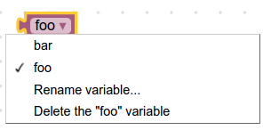
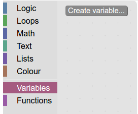

<!--
 * @Date: 2021-04-07 14:20:29
 * @LastEditors: tortorse
 * @LastEditTime: 2021-10-20 13:45:26
 * @FilePath: \blockly-document-chinese\docs\guides\create-custom-blocks\variables.md
-->
# 变量

变量是一个重要的编程概念。Blockly 支持动态类型语言，例如 Python 和 JavaScript，并且通过一些额外的工作，您可以添加信息以支持强类型语言（或静态类型语言），例如 Java 或 C。

[这]((https://www.sitepoint.com/typing-versus-dynamic-typing/))是有关动态类型语言与静态类型语言的更多信息。

Blockly 提供变量字段，这些字段是动态下拉框，显示用户提供的变量名称。下面是一个例子。




默认情况下，Blockly 允许将任何类型分配给变量，并且 Blockly 提供的所有生成器都用于动态类型语言。如果您使用的是类型化语言，则可以通过执行以下操作来配置 Blockly 以支持它：


- [指定变量类型及其块](#有类型变量块), 包括 getter 和 setter。

- [配置工具箱](#将变量添加到工具箱) 以使用您的变量类型和块。

- 为变量及其块[定义生成器](#定义生成器)。


## 无类型变量块

访问和操作变量的最基本块是 getter 和 setter 块。让我们来看看 Blockly 提供的 getter 和 setter 块。

:::: tabs
::: tab JSON
```JSON
// Block for variable getter.
{
  "type": "variables_get",
  "message0": "%1",
  "args0": [
    {    // Beginning of the field variable dropdown
      "type": "field_variable",
      "name": "VAR",    // Static name of the field
      "variable": "%{BKY_VARIABLES_DEFAULT_NAME}"    // Given at runtime
    }    // End of the field variable dropdown
  ],
  "output": null,    // Null means the return value can be of any type
  ...
},

// Block for variable setter.
{
  "type": "variables_set",
  "message0": "%{BKY_VARIABLES_SET}",
  "args0": [
    {
      "type": "field_variable",
      "name": "VAR",
      "variable": "%{BKY_VARIABLES_DEFAULT_NAME}"
    },
    {
      "type": "input_value",    // This expects an input of any type
      "name": "VALUE"
    }
  ],
  ...
}
```
:::
::: tab Javascript
```javascript
// Block for variable getter.
Blockly.Blocks['variables_get'] = {
  init: function() {
    this.appendDummyInput()
      .appendField(new Blockly.FieldVariable("VAR_NAME"), "FIELD_NAME");
    this.setOutput(true, null);
    ...
  }
};

// Block for variable setter.
Blockly.Blocks['variables_set'] = {
  init: function() {
    this.appendValueInput("NAME")
        .setCheck(null)
        .appendField("set")
        .appendField(new Blockly.FieldVariable("VAR_NAME"), "FIELD_NAME")
        .appendField("to");
    this.setOutput(true, null);
    ...
  }
};
```
:::
::::

这将创建以下两个块：


要注意的一个重要细节是，通过将变量 getter 的“输出”设置为 null，返回值可以是任何类型。另外，请注意变量 setter 的输入没有指定任何检查。因此，变量可以设置为任何类型的值。

## 有类型变量块

您可以添加强制类型检查的 getter 和 setter。例如，如果您创建了一个“Panda”类型的变量，以下定义将创建一个具有适当类型的 getter 和 setter。

:::: tabs
::: tab JSON
```JSON
 // Block for Panda variable getter.
 {
  "type": "variables_get_panda",
  "message0": "%1",
  "args0": [
    {
      "type": "field_variable",
      "name": "VAR",
      "variable": "%{BKY_VARIABLES_DEFAULT_NAME}",
      "variableTypes": ["Panda"],    // Specifies what types to put in the dropdown
      "defaultType": "Panda"
    }
  ],
  "output": "Panda",    // Returns a value of "Panda"
  ...
},

 // Block for Panda variable setter.
{
  "type": "variables_set_panda",
  "message0": "%{BKY_VARIABLES_SET}",
  "args0": [
    {
      "type": "field_variable",
      "name": "VAR",
      "variable": "%{BKY_VARIABLES_DEFAULT_NAME}",
      "variableTypes": ["Panda"],
      "defaultType": "Panda"
    },
    {
      "type": "input_value",
      "name": "VALUE",
      "check": "Panda"    // Checks that the input value is of type "Panda"
    }
  ],
  "previousStatement": null,
  "nextStatement": null,
  ...
}
```
:::
::: tab Javascript
```javascript
// Block for variable getter.
Blockly.Blocks['variables_get_panda'] = {
  init: function() {
    this.appendDummyInput()
      .appendField(new Blockly.FieldVariable(
          "VAR_NAME", ['Panda'], 'Panda'), "FIELD_NAME");
    this.setOutput(true, 'Panda');
    ...
  }
};

// Block for variable setter.
Blockly.Blocks['variables_set_panda'] = {
  init: function() {
    this.appendValueInput("NAME")
        .setCheck('Panda')
        .appendField("set")
        .appendField(new Blockly.FieldVariable(
            "VAR_NAME", null, ['Panda'], 'Panda'), "FIELD_NAME")
        .appendField("to");
        this.setPreviousStatement(true, null);
        this.setNextStatement(true, null);
    ...
  }
};
```
:::
::::

这将创建两种类型的块，getter 和 setter。他们的下拉菜单只显示 Panda 类型的变量。它们的输入和输出只接受 Panda 类型的连接。该defaultType字段必须被设置为在所述值中的一个variableTypes阵列。不设置defaultTypewhile 提供variableTypes数组将导致抛出错误。

默认情况下，没有视觉指示器来告诉用户正在使用哪种类型。区分变量类型的一种简单方法是通过 [颜色](/guides/create-custom-blocks/define-blocks.html#块颜色)。

:::tip 注意
variableTypes 键在 field_variable 上是可选的。如果未定义，则仅显示空字符串类型 “” 的变量。要显示任何类型的所有变量，请使用 "variableTypes": null。
:::

## 将变量添加到工具箱

为了使这种新类型的变量对您的用户有用，您需要添加一种创建和使用新变量的方法。

如果您还没有，请为变量创建一个新的 [动态类别](/guides/configure/toolbox.html#动态分类)。



将新的 getter 和 setter 添加到类别中。


### 创建变量按钮


接下来，您的用户需要一种创建变量的方法。最简单的方法是使用“创建变量” [按钮](/guides/configure/toolbox.html#按钮和标签)。

创建按钮时，进行回调调用

```javascript
Blockly.Variables.createVariableButtonHandler(button.getTargetWorkspace(), null, 'panda');
```

并且会创建一个 Panda 类型的变量！

允许用户创建多种类型变量的最简单方法是为每种类型设置一个“创建”按钮（例如创建字符串变量、创建数字变量、创建熊猫变量）。

如果你有两个或三个以上的变量类型，你很快就会有太多的按钮。在这种情况下，请考虑使用 [@blockly/plugin-typed-variable-modal]([@blockly/plugin-typed-variable-modal](https://www.npmjs.com/package/@blockly/plugin-typed-variable-modal)) 显示一个弹出窗口，用户可以从中选择所需的变量类型。
## 定义生成器

最后，您需要为新变量块 [定义生成器](/guides/create-custom-blocks/generating-code.html)。您还可以直接使用 Blockly.Workspace.getAllVariables() 访问变量列表以获取所有类型的所有变量或使用 Blockly.Workspace.getVariablesOfType() 获取特定类型的所有变量。

