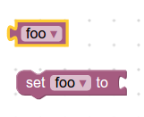

<!--
 * @Date: 2021-04-07 14:20:29
 * @LastEditors: tortorse
 * @LastEditTime: 2021-10-20 13:45:26
 * @FilePath: \blockly-document-chinese\docs\guides\create-custom-blocks\variables.md
-->
# Variables

Variables are an important programming concept. Blockly supports dynamically typed languages such as Python and JavaScript and with a little extra work, you can add information to support strongly typed languages (or static typed languages) such as Java or C.

[Here](https://www.sitepoint.com/typing-versus-dynamic-typing/) is more information on dyamic versus static typed languages.

Blockly supplies variable fields which are dynamic dropdown boxes that show the names of variables the user has provided. Below is an example of one.


By default, Blockly allows any type to be assigned to a variable and all of Blockly's provided generators are for dynamically typed languages. If you are using a typed language instead, you can configure Blockly to support it by doing the following:

- [Specify a variable type and its blocks](#typed_variable_blocks), including getters and setters.

- [Configure the toolbox](#add_variables_to_toolbox) to use your variable type and blocks.

- [Define generators](#define_generators) for variables and their blocks.

## Untyped Variable Blocks
The most basic blocks for accessing and manipulating a variable are the getter and setter blocks. Let's walk through the getter and setter blocks that Blockly provides.

:::: tabs
::: tab JSON
```JSON
// Block for variable getter.
{
  "type": "variables_get",
  "message0": "%1",
  "args0": [
    {    // Beginning of the field variable dropdown
      "type": "field_variable",
      "name": "VAR",    // Static name of the field
      "variable": "%{BKY_VARIABLES_DEFAULT_NAME}"    // Given at runtime
    }    // End of the field variable dropdown
  ],
  "output": null,    // Null means the return value can be of any type
  ...
},

// Block for variable setter.
{
  "type": "variables_set",
  "message0": "%{BKY_VARIABLES_SET}",
  "args0": [
    {
      "type": "field_variable",
      "name": "VAR",
      "variable": "%{BKY_VARIABLES_DEFAULT_NAME}"
    },
    {
      "type": "input_value",    // This expects an input of any type
      "name": "VALUE"
    }
  ],
  ...
}
```
:::
::: tab Javascript
```javascript
// Block for variable getter.
Blockly.Blocks['variables_get'] = {
  init: function() {
    this.appendDummyInput()
      .appendField(new Blockly.FieldVariable("VAR_NAME"), "FIELD_NAME");
    this.setOutput(true, null);
    ...
  }
};

// Block for variable setter.
Blockly.Blocks['variables_set'] = {
  init: function() {
    this.appendValueInput("NAME")
        .setCheck(null)
        .appendField("set")
        .appendField(new Blockly.FieldVariable("VAR_NAME"), "FIELD_NAME")
        .appendField("to");
    this.setOutput(true, null);
    ...
  }
};
```
:::
::::

This creates the following two blocks:



An important detail to notice is that by setting the variable getter's "output" to null, the return value can be of any type. Also, notice that variable setter's input does not specify any checks. As a result, the variable can be set to any type of value.

## Typed Variable Blocks

You can add getters and setters that enforce type checking. For example, if you have created a variable of type "Panda", the following definitions create a getter and setter with the appropriate types.

:::: tabs
::: tab JSON
```JSON
 // Block for Panda variable getter.
 {
  "type": "variables_get_panda",
  "message0": "%1",
  "args0": [
    {
      "type": "field_variable",
      "name": "VAR",
      "variable": "%{BKY_VARIABLES_DEFAULT_NAME}",
      "variableTypes": ["Panda"],    // Specifies what types to put in the dropdown
      "defaultType": "Panda"
    }
  ],
  "output": "Panda",    // Returns a value of "Panda"
  ...
},

 // Block for Panda variable setter.
{
  "type": "variables_set_panda",
  "message0": "%{BKY_VARIABLES_SET}",
  "args0": [
    {
      "type": "field_variable",
      "name": "VAR",
      "variable": "%{BKY_VARIABLES_DEFAULT_NAME}",
      "variableTypes": ["Panda"],
      "defaultType": "Panda"
    },
    {
      "type": "input_value",
      "name": "VALUE",
      "check": "Panda"    // Checks that the input value is of type "Panda"
    }
  ],
  "previousStatement": null,
  "nextStatement": null,
  ...
}
```
:::
::: tab Javascript
```javascript
// Block for variable getter.
Blockly.Blocks['variables_get_panda'] = {
  init: function() {
    this.appendDummyInput()
      .appendField(new Blockly.FieldVariable(
          "VAR_NAME", ['Panda'], 'Panda'), "FIELD_NAME");
    this.setOutput(true, 'Panda');
    ...
  }
};

// Block for variable setter.
Blockly.Blocks['variables_set_panda'] = {
  init: function() {
    this.appendValueInput("NAME")
        .setCheck('Panda')
        .appendField("set")
        .appendField(new Blockly.FieldVariable(
            "VAR_NAME", null, ['Panda'], 'Panda'), "FIELD_NAME")
        .appendField("to");
        this.setPreviousStatement(true, null);
        this.setNextStatement(true, null);
    ...
  }
};
```
:::
::::

This creates two types of blocks, a getter and a setter. Their dropdowns only display variables of type Panda. Their inputs and outputs only accept connections with type Panda. The `defaultType` of the field must be set to one of the values in the variableTypes array. Not setting the `defaultType` while providing a variableTypes array will cause an error to be thrown.

By default there is no visual indicator to tell the user which type is being used. One easy way to differentiate variable types is by [colour](/guides/create-custom-blocks/define-blocks.html#块颜色).

:::tip 提示
The variableTypes key is optional on a field_variable. If it is undefined only variables of the empty string type "" will be shown. To show all variables of any type use "variableTypes": null.
:::

## Add Variables to Toolbox

To make this new type of variable useful to your users, you need to add a way to create and use the new variables.

Create a new [dynamic category](/guides/configure/toolbox.html#动态分类) for variables if you do not already have one.


Add your new getters and setters to the category.


### Create Variable Button

Next, your user needs a way to create variables. The simplest way is with a "Create Variable" [button](/guides/configure/toolbox.html#按钮和标签).

When creating the button, make the callback call

```javascript
Blockly.Variables.createVariableButtonHandler(button.getTargetWorkspace(), null, 'panda');
```

and a Panda typed variable will be created!

The easiest way to allow users to create variables of multiple types is to have one "create" button per type (e.g. Create String Variable, Create Number Variable, Create Panda Variable).

If you have more than two or three variable types, you can quickly end up with too many buttons. In that case, consider using [@blockly/plugin-typed-variable-modal](https://www.npmjs.com/package/@blockly/plugin-typed-variable-modal) to display a popup from which users can select their desired variable type.

## Define Generators

Finally, you will need to [define generators](/guides/create-custom-blocks/generating-code.html) for your new variable blocks. You can also access the list of variables directly with Blockly.Workspace.getAllVariables() to get all variables of all types or Blockly.Workspace.getVariablesOfType() to get all variables of a specific type.