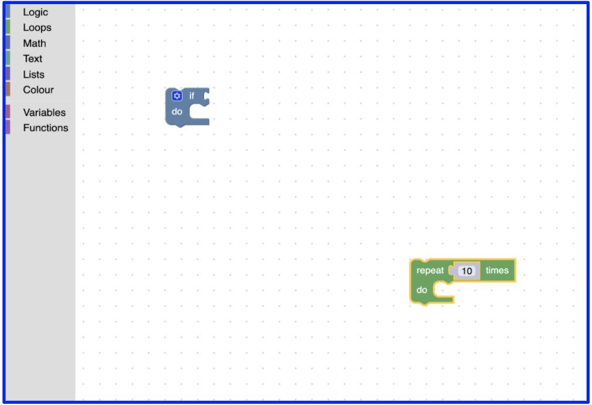
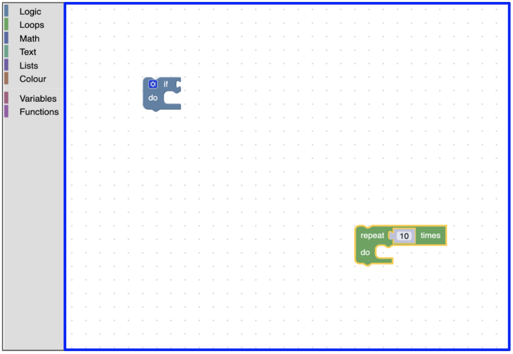

<!--
 * @Date: 2021-10-15 14:06:13
 * @LastEditors: tortorse
 * @LastEditTime: 2021-10-15 15:02:08
 * @FilePath: \blockly-document-chinese\docs\guides\plugins\interfaces\metrics_manager.md
-->
# The Metrics Manager 

The Metrics Manager collects and reports on all metrics pertaining to the Blockly workspace. This guide describes the meaning of each set of metrics returned from the Metrics Manager. For more information on the Metrics Manager you can also watch our [2021 Metrics Deep Dive](https://www.youtube.com/watch?v=6e6vntCqbic&list=PLSIUOFhnxEiCjoIwJ0jAdwpTZET73CK7d&index=9).

## Metrics

### Toolbox Metrics

`workspace.getMetricsManager().getToolboxMetrics();`

The toolbox metrics are composed of the `height`, `width` and `position` of a category toolbox. This does not include information on the flyout that is attached to the toolbox.

The `position` of the toolbox is of the type `Blockly.utils.toolbox.Position`.

### Flyout Metrics

`workspace.getMetricsManager().getFlyoutMetrics();`

The flyout metrics are composed of the height, width and position of a flyout toolbox. It is important to note, that this is not the flyout that is attached to the category toolbox. This only pertains to flyout toolboxes as shown in the below photo.

The `position` of the flyout is of the type `Blockly.utils.toolbox.Position`.

### SVG Metrics

`workspace.getMetricsManager().getSvgMetrics();`

The SVG metrics are composed of the width and height of the workspace's parent SVG. For the main workspace, this is the SVG with the blocklySvg class. This SVG includes the visible workspace as well as the toolbox.

### View Metrics

`workspace.getMetricsManager().getViewMetrics(opt_getWorkspaceCoordinates);`

The view metrics are composed of the `height`, `width`, `top` and `left` of the viewport. The viewport is the portion of the workspace that is visible. This does not include either type of toolbox.

The top left is relative to the workspace origin. As we drag around the workspace the top and left position of the viewport are updated.

### Absolute Metrics

`workspace.getMetricsManager().getAbsoluteMetrics();`

The absolute metrics are composed of the `top` and `left` offset of the viewport from the pareng SVG. Depending on where the toolbox is positioned on the workspace, this is usually the width or height of the toolbox.

